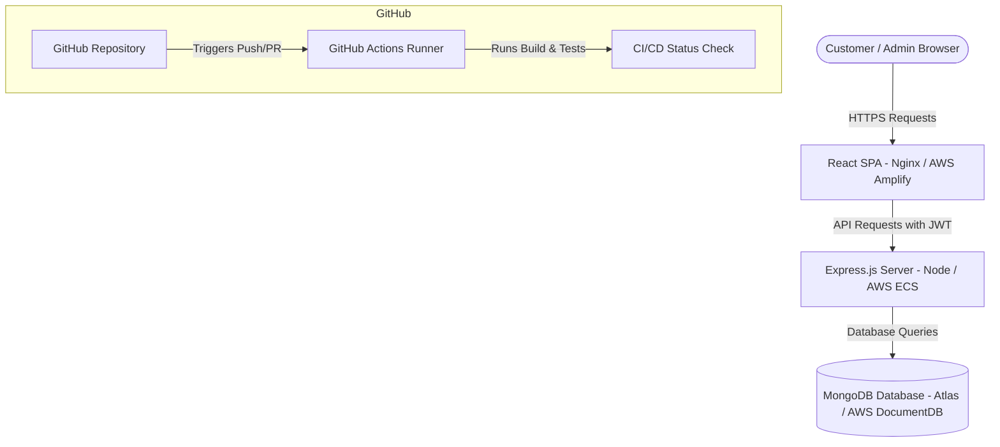

# Savora Project Report & Architecture Overview

This document provides a comprehensive overview of the **Savora Premium Indian Restaurant Management Platform**, highlighting the technical stack, system architecture, integration with GitHub, and potential AWS cloud deployment workflows.

---

## 1. Technologies & Languages Used

The project is structured as a modern full-stack web application split into two main sections: `frontend/` and `backend/`.

### Frontend Stack
*   **JavaScript (React.js):** The core application logic is built using React with Vite as the build tool for fast hot-reloading and optimization.
*   **HTML5 & CSS3:** Semantic structure and custom styling.
*   **Tailwind CSS:** Utilized for styling with a custom dark-luxury color scheme (featuring deep charcoal backgrounds and gold accenting).
*   **Zustand:** Centralized state management to share data dynamically (such as cart items, authentication, menu items, reservations, and orders) across pages.

### Backend Stack
*   **JavaScript (Node.js & Express):** Serves as the runtime and framework for the RESTful APIs.
*   **Mongoose (MongoDB Object Modeling):** Used to connect, validate, and query the MongoDB database.
*   **JSON Web Tokens (JWT) & Bcrypt:** Secure user authentication and password hashing.

---

## 2. System Architecture

---

## 3. How Git & GitHub Work

**Git** is the local version control system that tracks code changes, while **GitHub** acts as the cloud hosting service for our repository.

### GitHub Actions CI/CD Pipeline
Every time a code change is pushed to the `main` branch, a GitHub Actions runner executes the automated workflow defined in `.github/workflows/ci.yml`:
1.  **Frontend Build Job:** Sets up Node.js, installs dependencies using `npm ci`, and runs `npm run build` to verify there are no compilation or typing issues.
2.  **Backend Verification Job:** Verifies dependencies install successfully and checks backend stability.

---

## 4. How AWS (Amazon Web Services) Works for Deployment

AWS is the cloud provider where the Savora platform can be hosted in a scalable and secure production environment.

### Frontend Deployment
*   **AWS Amplify or S3 + CloudFront:**
    *   **Amplify:** Automatically hooks into your GitHub repository. Whenever you merge code to the `main` branch, Amplify builds the React frontend and deploys it to a global Content Delivery Network (CDN).
    *   **S3 & CloudFront:** The React static files are stored in an Amazon S3 Bucket and distributed globally with extremely low latency using CloudFront CDN.

### Backend Deployment
*   **AWS App Runner or ECS (Elastic Container Service):**
    *   **App Runner:** A fully managed container service that connects directly to the GitHub repository (or AWS ECR container registry), builds our backend Docker image automatically, and hosts the API with automatic scaling.
    *   **ECS & Fargate:** Runs the backend Docker container (packaged via `backend/Dockerfile`) in a serverless container environment, managed behind an Application Load Balancer (ALB).

### Database Hosting
*   **MongoDB Atlas (Recommended) or AWS DocumentDB:**
    *   **MongoDB Atlas:** A managed cloud database running on AWS infrastructure, providing automated backups, global scaling, and easy monitoring.
    *   **Amazon DocumentDB:** AWS's native MongoDB-compatible Document database service, designed to scale JSON workloads seamlessly.

---

## 5. Automated End-to-End Verification (Automatic Last Test)

To guarantee the reliability of critical business flows (authentication, ordering, and administrative tracking), we verified the system using an automated browser-agent execution test. 

### Automated Test Steps & Flow
1. **Unauthenticated Access Guard:**
   * Attempted to add menu items to the cart while signed out.
   * Verified the system intercepted the action, prompted a toast notification, and automatically redirected the user to the `/login` route.
2. **Customer Order Placement:**
   * Logged in as a customer (`user@example.com`).
   * Selected multiple items (e.g., 'Malabar Biryani', 'Paneer Butter Masala') and loaded the shopping cart.
   * Navigated to the newly configured `/checkout` route.
   * Executed a successful mock payment authorization and placed the order.
3. **Customer Dashboard Validation:**
   * Redirected to the customer dashboard and confirmed the order was displayed in the live order history with proper total price calculations.
4. **Admin Synchronization:**
   * Logged out of the customer session.
   * Logged in with Admin credentials (`admin@savora.com`).
   * Checked the **Admin Dashboard** and verified that the newly placed order and reservation details immediately populated on the admin control panel.
5. **Hydration & Refresh Persistence:**
   * Triggered repeated page refreshes on both customer and admin dashboard routes.
   * Confirmed the Zustand persistence layer kept the session intact and prevented any unauthorized redirects back to the login page.
